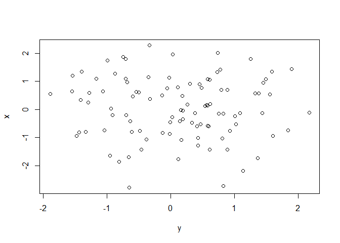
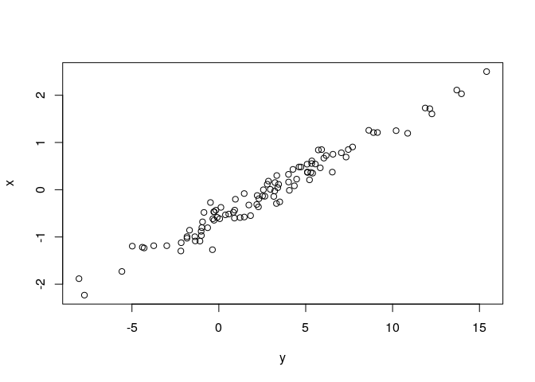

Hola
====

Hello!

``` r
a <- 1
b <- 2
print(a + b)
```

    ## [1] 3

Testing
=======

``` r
x <- rnorm(100)
y <- rnorm(100)
plot(y, x)
```



``` r
x <- rnorm(100)
y <- 5*x + 3 + rnorm(100)
model <- lm(y ~ x)
summary(model)
```

    ## 
    ## Call:
    ## lm(formula = y ~ x)
    ## 
    ## Residuals:
    ##      Min       1Q   Median       3Q      Max 
    ## -2.19400 -0.62118  0.06202  0.48526  2.93268 
    ## 
    ## Coefficients:
    ##             Estimate Std. Error t value Pr(>|t|)    
    ## (Intercept)  3.06883    0.09144   33.56   <2e-16 ***
    ## x            5.01343    0.10344   48.47   <2e-16 ***
    ## ---
    ## Signif. codes:  0 '***' 0.001 '**' 0.01 '*' 0.05 '.' 0.1 ' ' 1
    ## 
    ## Residual standard error: 0.913 on 98 degrees of freedom
    ## Multiple R-squared:  0.9599, Adjusted R-squared:  0.9595 
    ## F-statistic:  2349 on 1 and 98 DF,  p-value: < 2.2e-16

``` r
plot(y, x)
```


