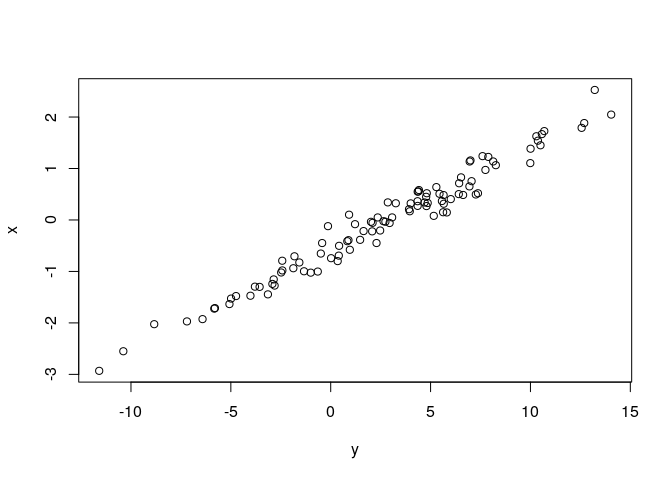

Navigation:
[__quantstrat__](quantstrat.md)

Hola
====

Hello!

``` r
a <- 1
b <- 2
print(a + b)
```

    ## [1] 3

Testing
=======

``` r
x <- rnorm(100)
y <- rnorm(100)
plot(y, x)
```


``` r
x <- rnorm(100)
y <- 5*x + 3 + rnorm(100)
model <- lm(y ~ x)
summary(model)
```

    ## 
    ## Call:
    ## lm(formula = y ~ x)
    ## 
    ## Residuals:
    ##      Min       1Q   Median       3Q      Max 
    ## -2.45807 -0.50716 -0.03206  0.59792  2.21960 
    ## 
    ## Coefficients:
    ##             Estimate Std. Error t value Pr(>|t|)    
    ## (Intercept)  2.87708    0.09860   29.18   <2e-16 ***
    ## x            4.88800    0.09284   52.65   <2e-16 ***
    ## ---
    ## Signif. codes:  0 '***' 0.001 '**' 0.01 '*' 0.05 '.' 0.1 ' ' 1
    ## 
    ## Residual standard error: 0.9854 on 98 degrees of freedom
    ## Multiple R-squared:  0.9659, Adjusted R-squared:  0.9655 
    ## F-statistic:  2772 on 1 and 98 DF,  p-value: < 2.2e-16

``` r
plot(y, x)
```



``` r
summary(x)
```

    ##     Min.  1st Qu.   Median     Mean  3rd Qu.     Max. 
    ## -2.93195 -0.79397  0.09124 -0.03526  0.55111  2.52679
