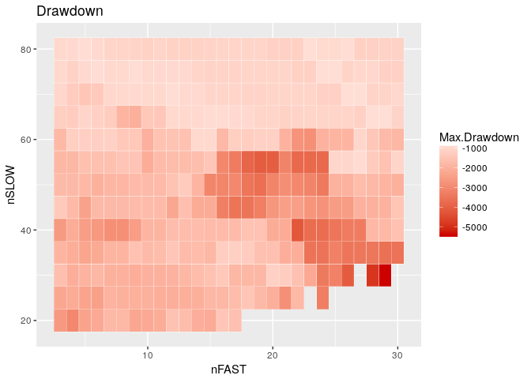

Quantstrat

``` r
library(quantstrat)
```

    ## Loading required package: quantmod

    ## Loading required package: xts

    ## Loading required package: zoo

    ## 
    ## Attaching package: 'zoo'

    ## The following objects are masked from 'package:base':
    ## 
    ##     as.Date, as.Date.numeric

    ## Loading required package: TTR

    ## Version 0.4-0 included new data defaults. See ?getSymbols.

    ## Loading required package: blotter

    ## Loading required package: FinancialInstrument

    ## Loading required package: PerformanceAnalytics

    ## 
    ## Attaching package: 'PerformanceAnalytics'

    ## The following object is masked from 'package:graphics':
    ## 
    ##     legend

    ## Loading required package: foreach

``` r
library(quantmod)
library(knitr)
library(ggplot2)
library(tidyverse)
```

    ## Loading tidyverse: tibble
    ## Loading tidyverse: tidyr
    ## Loading tidyverse: readr
    ## Loading tidyverse: purrr
    ## Loading tidyverse: dplyr

    ## Conflicts with tidy packages ----------------------------------------------

    ## accumulate(): purrr, foreach
    ## filter():     dplyr, stats
    ## first():      dplyr, xts
    ## lag():        dplyr, stats
    ## last():       dplyr, xts
    ## spread():     tidyr, FinancialInstrument
    ## when():       purrr, foreach

``` r
Sys.setenv(TZ = "UTC")
currency("USD")
```

    ## [1] "USD"

``` r
init_date <- "2000-12-31"
start_date <- "2001-01-01"
end_date <- "2016-12-10"
init_equity <- 1e4
adjustment <- TRUE

basic_symbols <- function() {
  symbols <- c(
        "IWM", # iShares Russell 2000 Index ETF
        "QQQ", # PowerShares QQQ TRust, Series 1 ETF
        "SPY" # SPDR S&P 500 ETF Trust
    )
}

enhanced_symbols <- function() {
  symbols <- c(
    basic_symbols(), 
    "TLT", # iShares Barclays 20+ Yr Treas. Bond ETF
    "XLB", # Materials Select Sector SPDR ETF
    "XLE", # Energy Select Sector SPDR ETF
    "XLF", # Financial Select Sector SPDR ETF
    "XLI", # Industrials Select Sector SPDR ETF
    "XLK", # Technology  Select Sector SPDR ETF
    "XLP", # Consumer Staples  Select Sector SPDR ETF
    "XLU", # Utilities  Select Sector SPDR ETF
    "XLV", # Health Care  Select Sector SPDR ETF
    "XLY" # Consumer Discretionary  Select Sector SPDR ETF
  )
}

global_symbols <- function() {
  symbols <- c(
    enhanced_symbols(), 
    "EFA", # iShares EAFE
    "EPP", # iShares Pacific Ex Japan
    "EWA", # iShares Australia
    "EWC", # iShares Canada
    "EWG", # iShares Germany
    "EWH", # iShares Hong Kong
    "EWJ", # iShares Japan
    "EWS", # iShares Singapore
    "EWT", # iShares Taiwan
    "EWU", # iShares UK
    "EWY", # iShares South Korea
    "EWZ", # iShares Brazil
    "EZU", # iShares MSCI EMU ETF
    "IGE", # iShares North American Natural Resources
    "IYR", # iShares U.S. Real Estate
    "IYZ", # iShares U.S. Telecom
    "LQD", # iShares Investment Grade Corporate Bonds
    "SHY" # iShares 42372 year TBonds
  )
}

# Guy Yollin, 2014
# http://www.r-programming.org/papers

checkBlotterUpdate <- function(port.st = portfolio.st, 
                               account.st = account.st, 
                               verbose = TRUE) {
    
    ok <- TRUE
    p <- getPortfolio(port.st)
    a <- getAccount(account.st)
    syms <- names(p$symbols)
    port.tot <- sum(
        sapply(
            syms, 
            FUN = function(x) eval(
                parse(
                    text = paste("sum(p$symbols", 
                                 x, 
                                 "posPL.USD$Net.Trading.PL)", 
                                 sep = "$")))))
    
    port.sum.tot <- sum(p$summary$Net.Trading.PL)
    
    if(!isTRUE(all.equal(port.tot, port.sum.tot))) {
        ok <- FALSE
        if(verbose) print("portfolio P&L doesn't match sum of symbols P&L")
    }
    
    initEq <- as.numeric(first(a$summary$End.Eq))
    endEq <- as.numeric(last(a$summary$End.Eq))
    
    if(!isTRUE(all.equal(port.tot, endEq - initEq)) ) {
        ok <- FALSE
        if(verbose) print("portfolio P&L doesn't match account P&L")
    }
    
    if(sum(duplicated(index(p$summary)))) {
        ok <- FALSE
        if(verbose)print("duplicate timestamps in portfolio summary")
        
    }
    
    if(sum(duplicated(index(a$summary)))) {
        ok <- FALSE
        if(verbose) print("duplicate timestamps in account summary")
    }
    return(ok)
}

chart.ME.custom <- function (Portfolio, Symbol, type = c("MAE", "MFE"), scale = c("cash", 
    "percent", "tick"), ...) 
{
    type = type[1]
    scale = scale[1]
    trades <- perTradeStats(Portfolio, Symbol, ...)
    trades$Pct.Net.Trading.PL <- 100 * trades$Pct.Net.Trading.PL
    trades$Pct.MAE <- 100 * trades$Pct.MAE
    trades$Pct.MFE <- 100 * trades$Pct.MFE
    profitable <- (trades$Net.Trading.PL > 0)
    switch(scale, cash = {
        .ylab <- "Profit/Loss (cash)"
        if (type == "MAE") {
            .cols <- c("MAE", "Net.Trading.PL")
            .xlab <- "Drawdown (cash)"
            .main <- "Maximum Adverse Excursion (MAE)"
        } else {
            .cols <- c("MFE", "Net.Trading.PL")
            .xlab <- "Run Up (cash)"
            .main <- "Maximum Favourable Excursion (MFE)"
        }
    }, percent = {
        .ylab <- "Profit/Loss (%)"
        if (type == "MAE") {
            .cols <- c("Pct.MAE", "Pct.Net.Trading.PL")
            .xlab <- "Drawdown (%)"
            .main <- "Maximum Adverse Excursion (MAE)"
        } else {
            .cols <- c("Pct.MFE", "Pct.Net.Trading.PL")
            .xlab <- "Run Up (%)"
            .main <- "Maximum Favourable Excursion (MFE)"
        }
    }, tick = {
        .ylab <- "Profit/Loss (ticks)"
        if (type == "MAE") {
            .cols <- c("tick.MAE", "tick.Net.Trading.PL")
            .xlab <- "Drawdown (ticks)"
            .main <- "Maximum Adverse Excursion (MAE)"
        } else {
            .cols <- c("tick.MFE", "tick.Net.Trading.PL")
            .xlab <- "Run Up (ticks)"
            .main <- "Maximum Favourable Excursion (MFE)"
        }
    })
    .main <- paste(Symbol, .main)
    plot(abs(trades[, .cols]), type = "n", xlab = .xlab, ylab = .ylab, 
        main = .main)
    grid()
    points(abs(trades[profitable, .cols]), pch = 24, col = "green", 
        bg = "green", cex = 0.6)
    points(abs(trades[!profitable, .cols]), pch = 25, col = "red", 
        bg = "red", cex = 0.6)
    abline(a = 0, b = 1, lty = "dashed", col = "darkgrey")
    #legend(x = "bottomright", inset = 0.1, legend = c("Profitable Trade", 
    #    "Losing Trade"), pch = c(24, 25), col = c("green", "red"), 
    #    pt.bg = c("green", "red"))
}
```

Get data
========

``` r
symbols <- "SPY"
getSymbols(Symbols = symbols, 
           src = "google",
           index.class = "POSIXct",
           from = start_date,
           to = end_date, 
           adjust = adjustment)
```

    ## 'getSymbols' currently uses auto.assign=TRUE by default, but will
    ## use auto.assign=FALSE in 0.5-0. You will still be able to use
    ## 'loadSymbols' to automatically load data. getOption("getSymbols.env")
    ## and getOption("getSymbols.auto.assign") will still be checked for
    ## alternate defaults.
    ## 
    ## This message is shown once per session and may be disabled by setting 
    ## options("getSymbols.warning4.0"=FALSE). See ?getSymbols for details.

    ## Warning in getSymbols.google(Symbols = "SPY", env = <environment>, verbose
    ## = FALSE, : google duplicate bug - missing Dec 28,29,30 of 2003

    ## [1] "SPY"

``` r
for (i in symbols) {
  assign(i, na.omit(get(i)))
}

stock(symbols,
      currency = "USD",
      multiplier = 1)
```

    ## [1] "SPY"

``` r
portfolio.st <- "Port.Luxor"
account.st <- "Acct.Luxor"
strategy.st <- "Strat.Luxor"

rm.strat(portfolio.st)
rm.strat(account.st)

initPortf(name = portfolio.st,
          symbols = symbols,
          initDate = init_date)
```

    ## [1] "Port.Luxor"

``` r
initAcct(name = account.st,
         portfolios = portfolio.st,
         initDate = init_date,
         initEq = init_equity)
```

    ## [1] "Acct.Luxor"

``` r
initOrders(portfolio = portfolio.st,portfolio,
           symbols = symbols,
           initDate = init_date)

strategy(strategy.st, store = TRUE)
```

Add indicators
==============

``` r
.nFast <- 10
.nSlow <- 30
.txnFees <- -10
.orderQty <- 100
.threshold <- 0.005
.stopLoss <- 0.09
.trailingStop <- 0.07

add.indicator(strategy = strategy.st,
              name = "SMA",
              arguments = list(x = quote(Cl(mktdata)), 
                               n = quote(.nFast)),
              label = "nFast")
```

    ## [1] "Strat.Luxor"

``` r
add.indicator(strategy = strategy.st,
              name = "SMA",
              arguments = list(x = quote(Cl(mktdata)),
                               n = quote(.nSlow)),
              label = "nSlow")
```

    ## [1] "Strat.Luxor"

Add signals
===========

``` r
add.signal(strategy = strategy.st,
           name = "sigCrossover",
           arguments = list(columns = c("nFast", "nSlow"),
                            relationship = "gte"),
           label = "long")
```

    ## [1] "Strat.Luxor"

``` r
add.signal(strategy = strategy.st,
           name = "sigCrossover",
           arguments = list(columns = c("nFast", "nSlow"),
                            relationship = "lt"),
           label = "short")
```

    ## [1] "Strat.Luxor"

Add rules
=========

``` r
add.rule(strategy = strategy.st,
         name = "ruleSignal",
         arguments = list(sigcol = "long",
                          sigval = TRUE,
                          orderqty = .orderQty,
                          ordertype = "stoplimit",
                          orderside = "long",
                          threshold = .threshold,
                          prefer = "High",
                          TxnFees = .txnFees,
                          replace = FALSE,
                          osFUN = osMaxPos,
                          orderset = "ocolong"),
         type = "enter",
         label = "EnterLONG")
```

    ## [1] "Strat.Luxor"

``` r
add.rule(strategy = strategy.st,
         name = "ruleSignal",
         arguments = list(sigcol = "short",
                          sigval = TRUE,
                          orderqty = -.orderQty,
                          ordertype = "stoplimit",
                          orderside = "short",
                          threshold = .threshold,
                          prefer = "Low",
                          TxnFees = .txnFees,
                          replace = FALSE,
                          oSFUN = osMaxPos,
                          orderset = "ocoshort"),
         type = "enter",
         label = "EnterSHORT")
```

    ## [1] "Strat.Luxor"

``` r
add.rule(strategy.st,
         name = "ruleSignal",
         arguments = list(sigcol = "short",
                          sigval = TRUE,
                          orderside = "long",
                          ordertype = "market",
                          orderqty = "all",
                          TxnFees = .txnFees,
                          replace = TRUE,
                          orderset = "ocolong"),
         type = "exit",
         label = "Exit2SHORT")
```

    ## [1] "Strat.Luxor"

``` r
add.rule(strategy.st,
         name = "ruleSignal",
         arguments = list(sigcol = "long",
                          sigval = TRUE,
                          orderside = "short",
                          ordertype = "market",
                          orderqty = "all",
                          TxnFees = .txnFees,
                          replace = TRUE,
                          orderset = "ocoshort"),
         type = "exit",
         label = "Exit2LONG")
```

    ## [1] "Strat.Luxor"

``` r
add.rule(strategy = strategy.st,
         name = "ruleSignal",
         arguments = list(sigcol = "long",
                          sigval = TRUE,
                          replace = FALSE,
                          orderside = "long",
                          ordertype = "stoptrailing",
                          tmult = TRUE,
                          threshold = quote(.trailingStop),
                          orderqty = "all",
                          orderset = "ocolong"),
         type = "chain",
         parent = "EnterLONG",
         label = "StopTrailingLONG",
         enabled = FALSE)
```

    ## [1] "Strat.Luxor"

``` r
add.rule(strategy = strategy.st,
         name = "ruleSignal",
         arguments = list(sigcol = "short",
                          sigval = TRUE,
                          replace = FALSE,
                          orderside = "short",
                          ordertype = "stoptrailing",
                          tmult = TRUE,
                          threshold = quote(.trailingStop),
                          orderqty = "all",
                          orderset = "ocoshort"),
         type = "chain",
         parent = "EnterSHORT",
         label = "StopTrailingSHORT",
         enabled = FALSE)
```

    ## [1] "Strat.Luxor"

``` r
add.rule(strategy.st,
         name = "ruleSignal",
         arguments = list(sigcol = "long", 
                          sigval = TRUE,
                          replace = FALSE,
                          orderside = "long",
                          ordertype = "stoplimit",
                          tmult = TRUE, 
                          threshold = quote(.stopLoss),
                          TxnFees = .txnFees,
                          orderqty = "all",
                          orderset = "ocolong"),
         type = "chain",
         parent = "EnterLONG",
         label = "StopLossLONG",
         enabled = FALSE)
```

    ## [1] "Strat.Luxor"

``` r
add.rule(strategy.st, 
         name = "ruleSignal",
         arguments = list(sigcol = "short",
                          sigval = TRUE,
                          replace = FALSE,
                          orderside = "short",
                          ordertype = "stoplimit",
                          tmult = TRUE,
                          threshold = quote(.stopLoss),
                          TxnFees = .txnFees,
                          orderqty = "all",
                          orderset = "ocoshort"),
         type = "chain",
         parent = "EnterSHORT",
         label = "StopLossSHORT",
         enabled = FALSE)
```

    ## [1] "Strat.Luxor"

``` r
for (symbol in symbols) {
  addPosLimit(portfolio = portfolio.st, 
              symbol = symbol,
              timestamp = init_date,
              maxpos = .orderQty)
}

# enable.rule(strategy.st, 
#             type = "chain",
#             label = "StopLoss")
# 
# enable.rule(strategy.st,
#             type = "chain",
#             label = "StopTrailing")
```

``` r
.paramFastSMA <- seq(3, 30, 1)
.paramSlowSMA <- seq(20, 80, 5)
.nSamples <- 5

add.distribution(strategy.st, 
                 paramset.label = "SMA",
                 component.type = "indicator",
                 component.label = "nFast",
                 variable = list(n = .paramFastSMA),
                 label = "nFAST")
```

    ## [1] "Strat.Luxor"

``` r
add.distribution(strategy.st,
                 paramset.label = "SMA",
                 component.type = "indicator",
                 component.label = "nSlow",
                 variable = list(n = .paramSlowSMA),
                 label = "nSLOW")
```

    ## [1] "Strat.Luxor"

``` r
add.distribution.constraint(strategy.st,
                            paramset.label = "SMA",
                            distribution.label.1 = "nFAST",
                            distribution.label.2 = "nSLOW",
                            operator = "<",
                            label = "SMA.Constraint")
```

    ## [1] "Strat.Luxor"

``` r
# kable(t(results$tradeStats))

# Visualize results

ggplot(results$tradeStats, aes(x = nFAST, y = nSLOW)) + 
  geom_tile(aes(fill = Net.Trading.PL), colour = "white") + 
  scale_fill_gradient2(low = "red3", mid = "white", high = "steelblue", midpoint = 0.5) + 
  ggtitle("Net Trading PnL")
```


``` r
ggplot(results$tradeStats, aes(nFAST, nSLOW)) + 
  geom_tile(aes(fill = Profit.To.Max.Draw), colour = "white") + 
  scale_fill_gradient2(low = "red3", mid = "white", high = "steelblue", midpoint = 0.5) + 
  ggtitle("Profit to Max Draw")
```


``` r
ggplot(results$tradeStats, aes(x = nFAST, y = nSLOW)) + 
  geom_tile(aes(fill = Max.Drawdown), colour = "white") + 
  scale_fill_gradient2(low = "red3", mid = "white", high = "steelblue", midpoint = 0.5) + 
  ggtitle("Drawdown")
```



``` r
ggplot(results$tradeStats, aes(x = nFAST, y = nSLOW)) + 
  geom_tile(aes(fill = log(Ann.Sharpe)), colour = "white") + 
  scale_fill_gradient(low = "white", high = "steelblue") + 
  ggtitle("Sharpe Ratio")
```

    ## Warning in log(Ann.Sharpe): NaNs produced


``` r
#chart.Posn(portfolio.st, Symbol = "SPY", Dates = "2008-01-01::2008-07-01",
#           TA = "add_SMA(n = 10, col = 2); add_SMA(n = 30, col = 4)")

chart.Posn(portfolio.st, Symbol = "SPY",  Dates = paste(start_date, end_date, sep="::"),
           TA = "add_SMA(n = .nFast, col = 2); add_SMA(n = .nSlow, col = 4)")
```


``` r
le <- as.data.frame(mktdata["2008-02-25::2008-03-07", c(1:4, 6:9)])
DT::datatable(le, 
              rownames = TRUE,
              extensions = c("Scroller", "FixedColumns"), 
              options = list(pageLength = 5, 
                             autoWidth = TRUE, 
                             deferRender = TRUE, 
                             scrollX = 200, 
                             scroller = TRUE,
                             fixedColumns = TRUE), 
              caption = htmltools::tags$caption(
                  "Table 6.1: mktdata object for Feb. 25, 2008 to Mar. 7, 2008"))
```

    ## PhantomJS not found. You can install it with webshot::install_phantomjs(). If it is installed, please make sure the phantomjs executable can be found via the PATH variable.

<!--html_preserve-->

<script type="application/json" data-for="htmlwidget-91b78be7341f783d3c15">{"x":{"filter":"none","extensions":["Scroller","FixedColumns"],"caption":"<caption>Table 6.1: mktdata object for Feb. 25, 2008 to Mar. 7, 2008<\/caption>","data":[["2008-02-25","2008-02-26","2008-02-27","2008-02-28","2008-02-29","2008-03-03","2008-03-04","2008-03-05","2008-03-06","2008-03-07"],[135.54,136.75,137.56,137.24,135.6,133.14,132.23,133.41,132.98,129.63],[137.65,138.95,139.14,137.96,137.02,133.81,133.4,134.77,133.22,131.74],[134.78,136.5,137.41,136.55,132.78,132.24,130.99,132.34,130.55,128.58],[137.33,138.36,138.22,136.87,133.82,133.5,132.99,133.83,131.06,129.71],[135.4805,135.6365,135.752,135.85,135.6725,135.3685,135.127,135.112,135.0125,134.8015],[141.0355,140.889333333333,140.74,140.5435,140.3125,140.098166666667,139.8345,139.549333333333,139.2185,138.845666666667],[null,null,null,null,null,null,null,null,null,null],[null,null,null,null,null,null,null,null,null,null]],"container":"<table class=\"display\">\n  <thead>\n    <tr>\n      <th> <\/th>\n      <th>SPY.Open<\/th>\n      <th>SPY.High<\/th>\n      <th>SPY.Low<\/th>\n      <th>SPY.Close<\/th>\n      <th>SMA.nFast<\/th>\n      <th>SMA.nSlow<\/th>\n      <th>long<\/th>\n      <th>short<\/th>\n    <\/tr>\n  <\/thead>\n<\/table>","options":{"pageLength":5,"autoWidth":true,"deferRender":true,"scrollX":200,"scroller":true,"fixedColumns":true,"columnDefs":[{"className":"dt-right","targets":[1,2,3,4,5,6,7,8]},{"orderable":false,"targets":0}],"order":[],"orderClasses":false,"lengthMenu":[5,10,25,50,100]}},"evals":[],"jsHooks":[]}</script>
<!--/html_preserve-->
``` r
ob <- data.table::as.data.table(getOrderBook(portfolio.st)[[portfolio.st]]$SPY)
DT::datatable(ob, 
              rownames = FALSE,
              filter = "top",
              extensions = c("Scroller", "FixedColumns"), 
              options = list(pageLength = 5, 
                             autoWidth = TRUE, 
                             deferRender = TRUE, 
                             scrollX = 200, 
                             scroller = TRUE, 
                             fixedColumns = TRUE), 
              caption = htmltools::tags$caption(
                  "Table 6.2: Order book for SPY"))
```

<!--html_preserve-->

<script type="application/json" data-for="htmlwidget-11a0598f381e651a7b22">{"x":{"filter":"top","filterHTML":"<tr>\n  <td data-type=\"date\" style=\"vertical-align: top;\">\n    <div class=\"form-group has-feedback\" style=\"margin-bottom: auto;\">\n      <input type=\"search\" placeholder=\"All\" class=\"form-control\" style=\"width: 100%;\"/>\n      <span class=\"glyphicon glyphicon-remove-circle form-control-feedback\"><\/span>\n    <\/div>\n    <div style=\"display: none; position: absolute; width: 200px;\">\n      <div data-min=\"988934400000\" data-max=\"1479859200000\"><\/div>\n      <span style=\"float: left;\"><\/span>\n      <span style=\"float: right;\"><\/span>\n    <\/div>\n  <\/td>\n  <td data-type=\"factor\" style=\"vertical-align: top;\">\n    <div class=\"form-group has-feedback\" style=\"margin-bottom: auto;\">\n      <input type=\"search\" placeholder=\"All\" class=\"form-control\" style=\"width: 100%;\"/>\n      <span class=\"glyphicon glyphicon-remove-circle form-control-feedback\"><\/span>\n    <\/div>\n    <div style=\"width: 100%; display: none;\">\n      <select multiple=\"multiple\" style=\"width: 100%;\" data-options=\"[&quot;-100&quot;,&quot;100&quot;,&quot;all&quot;]\"><\/select>\n    <\/div>\n  <\/td>\n  <td data-type=\"factor\" style=\"vertical-align: top;\">\n    <div class=\"form-group has-feedback\" style=\"margin-bottom: auto;\">\n      <input type=\"search\" placeholder=\"All\" class=\"form-control\" style=\"width: 100%;\"/>\n      <span class=\"glyphicon glyphicon-remove-circle form-control-feedback\"><\/span>\n    <\/div>\n    <div style=\"width: 100%; display: none;\">\n      <select multiple=\"multiple\" style=\"width: 100%;\" data-options=\"[&quot;102.8&quot;,&quot;102.885&quot;,&quot;105.805&quot;,&quot;105.89&quot;,&quot;106.655&quot;,&quot;107.465&quot;,&quot;107.54&quot;,&quot;108.46&quot;,&quot;108.765&quot;,&quot;109.355&quot;,&quot;109.46&quot;,&quot;109.84&quot;,&quot;110.835&quot;,&quot;110.895&quot;,&quot;110.96&quot;,&quot;111&quot;,&quot;111.615&quot;,&quot;112.97&quot;,&quot;113.115&quot;,&quot;113.155&quot;,&quot;113.18&quot;,&quot;113.47&quot;,&quot;113.745&quot;,&quot;114&quot;,&quot;114.205&quot;,&quot;114.25&quot;,&quot;114.55&quot;,&quot;114.585&quot;,&quot;114.945&quot;,&quot;115.485&quot;,&quot;116.605&quot;,&quot;116.65&quot;,&quot;116.735&quot;,&quot;116.955&quot;,&quot;117.43&quot;,&quot;117.63&quot;,&quot;120.055&quot;,&quot;120.25&quot;,&quot;120.255&quot;,&quot;120.475&quot;,&quot;121.075&quot;,&quot;122.255&quot;,&quot;122.66&quot;,&quot;122.78&quot;,&quot;122.795&quot;,&quot;123.08&quot;,&quot;124.64&quot;,&quot;124.685&quot;,&quot;124.755&quot;,&quot;124.945&quot;,&quot;126.17&quot;,&quot;127.355&quot;,&quot;127.41&quot;,&quot;127.99&quot;,&quot;128.455&quot;,&quot;128.465&quot;,&quot;129.4&quot;,&quot;130.715&quot;,&quot;132.935&quot;,&quot;133.24&quot;,&quot;133.32&quot;,&quot;133.37&quot;,&quot;133.695&quot;,&quot;133.705&quot;,&quot;133.83&quot;,&quot;133.935&quot;,&quot;134.25&quot;,&quot;134.485&quot;,&quot;134.495&quot;,&quot;135.39&quot;,&quot;135.74&quot;,&quot;135.835&quot;,&quot;140.155&quot;,&quot;140.99&quot;,&quot;142.135&quot;,&quot;142.93&quot;,&quot;145.12&quot;,&quot;145.145&quot;,&quot;145.255&quot;,&quot;145.32&quot;,&quot;145.325&quot;,&quot;146.775&quot;,&quot;147.6&quot;,&quot;147.67&quot;,&quot;152.19&quot;,&quot;152.775&quot;,&quot;164.265&quot;,&quot;165.13&quot;,&quot;168.255&quot;,&quot;168.87&quot;,&quot;169.235&quot;,&quot;171.115&quot;,&quot;175.215&quot;,&quot;177.48&quot;,&quot;187.155&quot;,&quot;190.485&quot;,&quot;190.54&quot;,&quot;196.685&quot;,&quot;197.36&quot;,&quot;200.735&quot;,&quot;202.76&quot;,&quot;202.815&quot;,&quot;203.96&quot;,&quot;204.245&quot;,&quot;204.805&quot;,&quot;204.97&quot;,&quot;205.325&quot;,&quot;205.42&quot;,&quot;206.465&quot;,&quot;206.99&quot;,&quot;207.375&quot;,&quot;207.4&quot;,&quot;207.95&quot;,&quot;208.005&quot;,&quot;208.345&quot;,&quot;208.625&quot;,&quot;208.66&quot;,&quot;209.53&quot;,&quot;210.13&quot;,&quot;210.225&quot;,&quot;214.005&quot;,&quot;214.24&quot;,&quot;215.305&quot;,&quot;220.7&quot;,&quot;220.765&quot;,&quot;82.53&quot;,&quot;82.945&quot;,&quot;84.695&quot;,&quot;88.05&quot;,&quot;89.725&quot;,&quot;90.61&quot;,&quot;90.855&quot;,&quot;90.995&quot;,&quot;91.13&quot;,&quot;92.96&quot;,&quot;93.04&quot;,&quot;93.075&quot;,&quot;93.335&quot;,&quot;96.135&quot;,&quot;99.115&quot;,&quot;99.62&quot;]\"><\/select>\n    <\/div>\n  <\/td>\n  <td data-type=\"factor\" style=\"vertical-align: top;\">\n    <div class=\"form-group has-feedback\" style=\"margin-bottom: auto;\">\n      <input type=\"search\" placeholder=\"All\" class=\"form-control\" style=\"width: 100%;\"/>\n      <span class=\"glyphicon glyphicon-remove-circle form-control-feedback\"><\/span>\n    <\/div>\n    <div style=\"width: 100%; display: none;\">\n      <select multiple=\"multiple\" style=\"width: 100%;\" data-options=\"[&quot;market&quot;,&quot;stoplimit&quot;]\"><\/select>\n    <\/div>\n  <\/td>\n  <td data-type=\"factor\" style=\"vertical-align: top;\">\n    <div class=\"form-group has-feedback\" style=\"margin-bottom: auto;\">\n      <input type=\"search\" placeholder=\"All\" class=\"form-control\" style=\"width: 100%;\"/>\n      <span class=\"glyphicon glyphicon-remove-circle form-control-feedback\"><\/span>\n    <\/div>\n    <div style=\"width: 100%; display: none;\">\n      <select multiple=\"multiple\" style=\"width: 100%;\" data-options=\"[&quot;long&quot;,&quot;short&quot;]\"><\/select>\n    <\/div>\n  <\/td>\n  <td data-type=\"factor\" style=\"vertical-align: top;\">\n    <div class=\"form-group has-feedback\" style=\"margin-bottom: auto;\">\n      <input type=\"search\" placeholder=\"All\" class=\"form-control\" style=\"width: 100%;\"/>\n      <span class=\"glyphicon glyphicon-remove-circle form-control-feedback\"><\/span>\n    <\/div>\n    <div style=\"width: 100%; display: none;\">\n      <select multiple=\"multiple\" style=\"width: 100%;\" data-options=\"[&quot;-0.005&quot;,&quot;0.005&quot;]\"><\/select>\n    <\/div>\n  <\/td>\n  <td data-type=\"factor\" style=\"vertical-align: top;\">\n    <div class=\"form-group has-feedback\" style=\"margin-bottom: auto;\">\n      <input type=\"search\" placeholder=\"All\" class=\"form-control\" style=\"width: 100%;\"/>\n      <span class=\"glyphicon glyphicon-remove-circle form-control-feedback\"><\/span>\n    <\/div>\n    <div style=\"width: 100%; display: none;\">\n      <select multiple=\"multiple\" style=\"width: 100%;\" data-options=\"[&quot;closed&quot;,&quot;replaced&quot;]\"><\/select>\n    <\/div>\n  <\/td>\n  <td data-type=\"factor\" style=\"vertical-align: top;\">\n    <div class=\"form-group has-feedback\" style=\"margin-bottom: auto;\">\n      <input type=\"search\" placeholder=\"All\" class=\"form-control\" style=\"width: 100%;\"/>\n      <span class=\"glyphicon glyphicon-remove-circle form-control-feedback\"><\/span>\n    <\/div>\n    <div style=\"width: 100%; display: none;\">\n      <select multiple=\"multiple\" style=\"width: 100%;\" data-options=\"[&quot;2001-05-07 00:00:00&quot;,&quot;2001-07-02 00:00:00&quot;,&quot;2001-07-05 00:00:00&quot;,&quot;2001-11-14 00:00:00&quot;,&quot;2002-02-01 00:00:00&quot;,&quot;2002-02-04 00:00:00&quot;,&quot;2002-03-18 00:00:00&quot;,&quot;2002-04-23 00:00:00&quot;,&quot;2002-09-12 00:00:00&quot;,&quot;2002-09-19&quot;,&quot;2002-09-20 00:00:00&quot;,&quot;2002-11-07 00:00:00&quot;,&quot;2002-11-21 00:00:00&quot;,&quot;2003-01-07 00:00:00&quot;,&quot;2003-01-17 00:00:00&quot;,&quot;2003-04-08 00:00:00&quot;,&quot;2003-04-22 00:00:00&quot;,&quot;2003-08-18 00:00:00&quot;,&quot;2003-08-26 00:00:00&quot;,&quot;2003-09-03 00:00:00&quot;,&quot;2004-03-24 00:00:00&quot;,&quot;2004-04-27 00:00:00&quot;,&quot;2004-05-03 00:00:00&quot;,&quot;2004-05-07 00:00:00&quot;,&quot;2004-06-17 00:00:00&quot;,&quot;2004-06-18 00:00:00&quot;,&quot;2004-07-23 00:00:00&quot;,&quot;2004-09-14 00:00:00&quot;,&quot;2004-10-01 00:00:00&quot;,&quot;2005-01-31 00:00:00&quot;,&quot;2005-02-18&quot;,&quot;2005-02-25 00:00:00&quot;,&quot;2005-04-05 00:00:00&quot;,&quot;2005-04-14 00:00:00&quot;,&quot;2005-05-31 00:00:00&quot;,&quot;2005-06-01 00:00:00&quot;,&quot;2005-09-30 00:00:00&quot;,&quot;2005-11-18 00:00:00&quot;,&quot;2006-05-25 00:00:00&quot;,&quot;2006-06-08 00:00:00&quot;,&quot;2006-08-09 00:00:00&quot;,&quot;2007-03-13 00:00:00&quot;,&quot;2007-04-16 00:00:00&quot;,&quot;2007-08-03 00:00:00&quot;,&quot;2007-09-27 00:00:00&quot;,&quot;2007-11-15 00:00:00&quot;,&quot;2008-04-16 00:00:00&quot;,&quot;2008-06-19 00:00:00&quot;,&quot;2008-09-03 00:00:00&quot;,&quot;2008-09-09&quot;,&quot;2008-09-10 00:00:00&quot;,&quot;2009-04-09 00:00:00&quot;,&quot;2009-07-15 00:00:00&quot;,&quot;2009-07-22&quot;,&quot;2009-07-23 00:00:00&quot;,&quot;2010-02-09 00:00:00&quot;,&quot;2010-03-11&quot;,&quot;2010-03-12 00:00:00&quot;,&quot;2010-05-21 00:00:00&quot;,&quot;2010-08-05 00:00:00&quot;,&quot;2010-08-09 00:00:00&quot;,&quot;2010-09-02 00:00:00&quot;,&quot;2010-09-17&quot;,&quot;2010-09-20 00:00:00&quot;,&quot;2011-04-06 00:00:00&quot;,&quot;2011-04-07 00:00:00&quot;,&quot;2011-04-08 00:00:00&quot;,&quot;2011-06-10 00:00:00&quot;,&quot;2011-07-26 00:00:00&quot;,&quot;2011-08-04&quot;,&quot;2011-08-05 00:00:00&quot;,&quot;2011-10-26 00:00:00&quot;,&quot;2011-10-27 00:00:00&quot;,&quot;2012-05-10 00:00:00&quot;,&quot;2012-05-14 00:00:00&quot;,&quot;2012-07-17 00:00:00&quot;,&quot;2012-11-07 00:00:00&quot;,&quot;2012-12-21 00:00:00&quot;,&quot;2013-01-02 00:00:00&quot;,&quot;2013-07-10 00:00:00&quot;,&quot;2013-07-19&quot;,&quot;2013-07-22 00:00:00&quot;,&quot;2013-09-11 00:00:00&quot;,&quot;2013-09-17&quot;,&quot;2013-09-18 00:00:00&quot;,&quot;2014-02-07 00:00:00&quot;,&quot;2014-02-28&quot;,&quot;2014-03-04 00:00:00&quot;,&quot;2014-08-19 00:00:00&quot;,&quot;2014-08-29&quot;,&quot;2014-09-02 00:00:00&quot;,&quot;2014-10-13 00:00:00&quot;,&quot;2014-11-13 00:00:00&quot;,&quot;2015-01-26 00:00:00&quot;,&quot;2015-02-19 00:00:00&quot;,&quot;2015-06-30 00:00:00&quot;,&quot;2015-08-10 00:00:00&quot;,&quot;2015-08-14 00:00:00&quot;,&quot;2015-08-19 00:00:00&quot;,&quot;2015-10-27 00:00:00&quot;,&quot;2015-10-28 00:00:00&quot;,&quot;2015-12-30 00:00:00&quot;,&quot;2016-03-14 00:00:00&quot;,&quot;2016-07-08 00:00:00&quot;,&quot;2016-07-12&quot;,&quot;2016-07-13 00:00:00&quot;,&quot;2016-09-27 00:00:00&quot;,&quot;2016-11-25 00:00:00&quot;]\"><\/select>\n    <\/div>\n  <\/td>\n  <td data-type=\"factor\" style=\"vertical-align: top;\">\n    <div class=\"form-group has-feedback\" style=\"margin-bottom: auto;\">\n      <input type=\"search\" placeholder=\"All\" class=\"form-control\" style=\"width: 100%;\"/>\n      <span class=\"glyphicon glyphicon-remove-circle form-control-feedback\"><\/span>\n    <\/div>\n    <div style=\"width: 100%; display: none;\">\n      <select multiple=\"multiple\" style=\"width: 100%;\" data-options=\"[&quot;&quot;,&quot;High&quot;,&quot;Low&quot;]\"><\/select>\n    <\/div>\n  <\/td>\n  <td data-type=\"factor\" style=\"vertical-align: top;\">\n    <div class=\"form-group has-feedback\" style=\"margin-bottom: auto;\">\n      <input type=\"search\" placeholder=\"All\" class=\"form-control\" style=\"width: 100%;\"/>\n      <span class=\"glyphicon glyphicon-remove-circle form-control-feedback\"><\/span>\n    <\/div>\n    <div style=\"width: 100%; display: none;\">\n      <select multiple=\"multiple\" style=\"width: 100%;\" data-options=\"[&quot;ocolong&quot;,&quot;ocoshort&quot;]\"><\/select>\n    <\/div>\n  <\/td>\n  <td data-type=\"disabled\" style=\"vertical-align: top;\">\n    <div class=\"form-group has-feedback\" style=\"margin-bottom: auto;\">\n      <input type=\"search\" placeholder=\"All\" class=\"form-control\" style=\"width: 100%;\"/>\n      <span class=\"glyphicon glyphicon-remove-circle form-control-feedback\"><\/span>\n    <\/div>\n  <\/td>\n  <td data-type=\"factor\" style=\"vertical-align: top;\">\n    <div class=\"form-group has-feedback\" style=\"margin-bottom: auto;\">\n      <input type=\"search\" placeholder=\"All\" class=\"form-control\" style=\"width: 100%;\"/>\n      <span class=\"glyphicon glyphicon-remove-circle form-control-feedback\"><\/span>\n    <\/div>\n    <div style=\"width: 100%; display: none;\">\n      <select multiple=\"multiple\" style=\"width: 100%;\" data-options=\"[&quot;EnterLONG&quot;,&quot;EnterSHORT&quot;,&quot;Exit2LONG&quot;,&quot;Exit2SHORT&quot;]\"><\/select>\n    <\/div>\n  <\/td>\n  <td data-type=\"disabled\" style=\"vertical-align: top;\">\n    <div class=\"form-group has-feedback\" style=\"margin-bottom: auto;\">\n      <input type=\"search\" placeholder=\"All\" class=\"form-control\" style=\"width: 100%;\"/>\n      <span class=\"glyphicon glyphicon-remove-circle form-control-feedback\"><\/span>\n    <\/div>\n  <\/td>\n<\/tr>","extensions":["Scroller","FixedColumns"],"caption":"<caption>Table 6.2: Order book for SPY<\/caption>","data":[["2001-05-04","2001-06-29","2001-06-29","2001-11-13","2001-11-13","2002-01-31","2002-01-31","2002-03-15","2002-03-15","2002-04-22","2002-04-22","2002-09-11","2002-09-11","2002-09-19","2002-11-06","2002-11-06","2003-01-06","2003-01-06","2003-04-07","2003-04-07","2003-08-15","2003-08-15","2003-09-02","2003-09-02","2004-03-23","2004-03-23","2004-04-26","2004-04-26","2004-04-30","2004-04-30","2004-06-16","2004-06-16","2004-07-22","2004-07-22","2004-09-13","2004-09-13","2005-01-28","2005-01-28","2005-02-18","2005-04-04","2005-04-04","2005-05-27","2005-05-27","2005-09-29","2005-09-29","2005-11-17","2005-11-17","2006-05-24","2006-05-24","2006-08-08","2006-08-08","2007-03-12","2007-03-12","2007-04-13","2007-04-13","2007-08-02","2007-08-02","2007-09-26","2007-09-26","2007-11-14","2007-11-14","2008-04-15","2008-04-15","2008-06-18","2008-06-18","2008-09-02","2008-09-02","2008-09-09","2009-04-08","2009-04-08","2009-07-14","2009-07-14","2009-07-22","2010-02-08","2010-02-08","2010-03-11","2010-05-20","2010-05-20","2010-08-04","2010-08-04","2010-09-01","2010-09-01","2010-09-17","2011-04-05","2011-04-05","2011-04-07","2011-04-07","2011-06-09","2011-06-09","2011-07-25","2011-07-25","2011-08-04","2011-10-25","2011-10-25","2012-05-09","2012-05-09","2012-07-16","2012-07-16","2012-11-06","2012-11-06","2012-12-20","2012-12-20","2013-07-09","2013-07-09","2013-07-19","2013-09-10","2013-09-10","2013-09-17","2014-02-06","2014-02-06","2014-02-28","2014-08-18","2014-08-18","2014-08-29","2014-10-10","2014-10-10","2014-11-12","2014-11-12","2015-01-23","2015-01-23","2015-02-18","2015-02-18","2015-06-29","2015-06-29","2015-08-07","2015-08-07","2015-08-13","2015-08-13","2015-10-26","2015-10-26","2015-12-29","2015-12-29","2016-03-11","2016-03-11","2016-07-07","2016-07-07","2016-07-12","2016-09-26","2016-09-26","2016-11-23","2016-11-23"],["100","all","-100","all","100","all","-100","all","100","all","-100","all","100","-100","all","100","all","-100","all","100","all","-100","all","100","all","-100","all","100","all","-100","all","100","all","-100","all","100","all","-100","100","all","-100","all","100","all","-100","all","100","all","-100","all","100","all","-100","all","100","all","-100","all","100","all","-100","all","100","all","-100","all","100","-100","all","100","all","-100","100","all","-100","100","all","-100","all","100","all","-100","100","all","-100","all","100","all","-100","all","100","-100","all","100","all","-100","all","100","all","-100","all","100","all","-100","100","all","-100","100","all","-100","100","all","-100","100","all","-100","all","100","all","-100","all","100","all","-100","all","100","all","-100","all","100","all","-100","all","100","all","-100","100","all","-100","all","100"],["127.355","122.78","122.255","114.55","114.585","113.18","111.615","116.65","116.955","111","110.835","91.13","93.335","84.695","93.04","93.075","92.96","90.995","88.05","90.855","99.62","99.115","102.8","102.885","109.46","109.355","114.25","114.945","110.96","110.895","114","114.205","109.84","108.765","113.47","113.745","117.43","116.605","120.475","117.63","116.735","120.25","120.255","122.66","121.075","124.64","124.685","126.17","124.755","127.41","128.465","140.99","140.155","145.32","145.325","147.6","145.255","152.19","152.775","147.67","146.775","133.37","133.695","134.25","133.705","127.99","130.715","122.795","82.53","82.945","90.61","89.725","96.135","105.89","105.805","115.485","107.54","107.465","112.97","113.115","108.46","106.655","113.155","133.24","132.935","133.32","133.935","129.4","128.455","133.83","134.495","120.055","123.08","124.945","135.74","134.485","135.39","135.835","142.93","142.135","145.12","145.145","165.13","164.265","169.235","168.87","168.255","171.115","177.48","175.215","187.155","197.36","196.685","200.735","190.54","190.485","203.96","204.245","204.97","204.805","210.13","210.225","205.42","205.325","207.95","208.345","208.66","208.005","206.99","207.375","207.4","206.465","202.76","202.815","209.53","208.625","215.305","214.24","214.005","220.7","220.765"],["stoplimit","market","stoplimit","market","stoplimit","market","stoplimit","market","stoplimit","market","stoplimit","market","stoplimit","stoplimit","market","stoplimit","market","stoplimit","market","stoplimit","market","stoplimit","market","stoplimit","market","stoplimit","market","stoplimit","market","stoplimit","market","stoplimit","market","stoplimit","market","stoplimit","market","stoplimit","stoplimit","market","stoplimit","market","stoplimit","market","stoplimit","market","stoplimit","market","stoplimit","market","stoplimit","market","stoplimit","market","stoplimit","market","stoplimit","market","stoplimit","market","stoplimit","market","stoplimit","market","stoplimit","market","stoplimit","stoplimit","market","stoplimit","market","stoplimit","stoplimit","market","stoplimit","stoplimit","market","stoplimit","market","stoplimit","market","stoplimit","stoplimit","market","stoplimit","market","stoplimit","market","stoplimit","market","stoplimit","stoplimit","market","stoplimit","market","stoplimit","market","stoplimit","market","stoplimit","market","stoplimit","market","stoplimit","stoplimit","market","stoplimit","stoplimit","market","stoplimit","stoplimit","market","stoplimit","stoplimit","market","stoplimit","market","stoplimit","market","stoplimit","market","stoplimit","market","stoplimit","market","stoplimit","market","stoplimit","market","stoplimit","market","stoplimit","market","stoplimit","market","stoplimit","stoplimit","market","stoplimit","market","stoplimit"],["long","long","short","short","long","long","short","short","long","long","short","short","long","short","short","long","long","short","short","long","long","short","short","long","long","short","short","long","long","short","short","long","long","short","short","long","long","short","long","long","short","short","long","long","short","short","long","long","short","short","long","long","short","short","long","long","short","short","long","long","short","short","long","long","short","short","long","short","short","long","long","short","long","long","short","long","long","short","short","long","long","short","long","long","short","short","long","long","short","short","long","short","short","long","long","short","short","long","long","short","short","long","long","short","long","long","short","long","long","short","long","long","short","long","long","short","short","long","long","short","short","long","long","short","short","long","long","short","short","long","long","short","short","long","long","short","long","long","short","short","long"],["0.005",null,"-0.005",null,"0.005",null,"-0.005",null,"0.005",null,"-0.005",null,"0.005","-0.005",null,"0.005",null,"-0.005",null,"0.005",null,"-0.005",null,"0.005",null,"-0.005",null,"0.005",null,"-0.005",null,"0.005",null,"-0.005",null,"0.005",null,"-0.005","0.005",null,"-0.005",null,"0.005",null,"-0.005",null,"0.005",null,"-0.005",null,"0.005",null,"-0.005",null,"0.005",null,"-0.005",null,"0.005",null,"-0.005",null,"0.005",null,"-0.005",null,"0.005","-0.005",null,"0.005",null,"-0.005","0.005",null,"-0.005","0.005",null,"-0.005",null,"0.005",null,"-0.005","0.005",null,"-0.005",null,"0.005",null,"-0.005",null,"0.005","-0.005",null,"0.005",null,"-0.005",null,"0.005",null,"-0.005",null,"0.005",null,"-0.005","0.005",null,"-0.005","0.005",null,"-0.005","0.005",null,"-0.005","0.005",null,"-0.005",null,"0.005",null,"-0.005",null,"0.005",null,"-0.005",null,"0.005",null,"-0.005",null,"0.005",null,"-0.005",null,"0.005",null,"-0.005","0.005",null,"-0.005",null,"0.005"],["closed","closed","closed","closed","closed","closed","closed","closed","closed","closed","closed","closed","replaced","closed","closed","closed","closed","closed","closed","closed","closed","closed","closed","closed","closed","closed","closed","closed","closed","closed","closed","closed","closed","closed","closed","closed","closed","replaced","closed","closed","closed","closed","closed","closed","closed","closed","closed","closed","closed","closed","closed","closed","closed","closed","closed","closed","closed","closed","closed","closed","closed","closed","closed","closed","closed","closed","replaced","closed","closed","closed","closed","replaced","closed","closed","replaced","closed","closed","closed","closed","closed","closed","replaced","closed","closed","closed","closed","closed","closed","closed","closed","replaced","closed","closed","closed","closed","closed","closed","closed","closed","closed","closed","closed","closed","replaced","closed","closed","replaced","closed","closed","replaced","closed","closed","replaced","closed","closed","closed","closed","closed","closed","closed","closed","closed","closed","closed","closed","closed","closed","closed","closed","closed","closed","closed","closed","closed","closed","replaced","closed","closed","closed","closed","closed"],["2001-05-07 00:00:00","2001-07-02 00:00:00","2001-07-05 00:00:00","2001-11-14 00:00:00","2001-11-14 00:00:00","2002-02-01 00:00:00","2002-02-04 00:00:00","2002-03-18 00:00:00","2002-03-18 00:00:00","2002-04-23 00:00:00","2002-04-23 00:00:00","2002-09-12 00:00:00","2002-09-19","2002-09-20 00:00:00","2002-11-07 00:00:00","2002-11-21 00:00:00","2003-01-07 00:00:00","2003-01-17 00:00:00","2003-04-08 00:00:00","2003-04-22 00:00:00","2003-08-18 00:00:00","2003-08-26 00:00:00","2003-09-03 00:00:00","2003-09-03 00:00:00","2004-03-24 00:00:00","2004-03-24 00:00:00","2004-04-27 00:00:00","2004-04-27 00:00:00","2004-05-03 00:00:00","2004-05-07 00:00:00","2004-06-17 00:00:00","2004-06-18 00:00:00","2004-07-23 00:00:00","2004-07-23 00:00:00","2004-09-14 00:00:00","2004-10-01 00:00:00","2005-01-31 00:00:00","2005-02-18","2005-02-25 00:00:00","2005-04-05 00:00:00","2005-04-14 00:00:00","2005-05-31 00:00:00","2005-06-01 00:00:00","2005-09-30 00:00:00","2005-09-30 00:00:00","2005-11-18 00:00:00","2005-11-18 00:00:00","2006-05-25 00:00:00","2006-06-08 00:00:00","2006-08-09 00:00:00","2006-08-09 00:00:00","2007-03-13 00:00:00","2007-03-13 00:00:00","2007-04-16 00:00:00","2007-04-16 00:00:00","2007-08-03 00:00:00","2007-08-03 00:00:00","2007-09-27 00:00:00","2007-09-27 00:00:00","2007-11-15 00:00:00","2007-11-15 00:00:00","2008-04-16 00:00:00","2008-04-16 00:00:00","2008-06-19 00:00:00","2008-06-19 00:00:00","2008-09-03 00:00:00","2008-09-09","2008-09-10 00:00:00","2009-04-09 00:00:00","2009-04-09 00:00:00","2009-07-15 00:00:00","2009-07-22","2009-07-23 00:00:00","2010-02-09 00:00:00","2010-03-11","2010-03-12 00:00:00","2010-05-21 00:00:00","2010-05-21 00:00:00","2010-08-05 00:00:00","2010-08-09 00:00:00","2010-09-02 00:00:00","2010-09-17","2010-09-20 00:00:00","2011-04-06 00:00:00","2011-04-07 00:00:00","2011-04-08 00:00:00","2011-04-08 00:00:00","2011-06-10 00:00:00","2011-06-10 00:00:00","2011-07-26 00:00:00","2011-08-04","2011-08-05 00:00:00","2011-10-26 00:00:00","2011-10-27 00:00:00","2012-05-10 00:00:00","2012-05-14 00:00:00","2012-07-17 00:00:00","2012-07-17 00:00:00","2012-11-07 00:00:00","2012-11-07 00:00:00","2012-12-21 00:00:00","2013-01-02 00:00:00","2013-07-10 00:00:00","2013-07-19","2013-07-22 00:00:00","2013-09-11 00:00:00","2013-09-17","2013-09-18 00:00:00","2014-02-07 00:00:00","2014-02-28","2014-03-04 00:00:00","2014-08-19 00:00:00","2014-08-29","2014-09-02 00:00:00","2014-10-13 00:00:00","2014-10-13 00:00:00","2014-11-13 00:00:00","2014-11-13 00:00:00","2015-01-26 00:00:00","2015-01-26 00:00:00","2015-02-19 00:00:00","2015-02-19 00:00:00","2015-06-30 00:00:00","2015-06-30 00:00:00","2015-08-10 00:00:00","2015-08-10 00:00:00","2015-08-14 00:00:00","2015-08-19 00:00:00","2015-10-27 00:00:00","2015-10-28 00:00:00","2015-12-30 00:00:00","2015-12-30 00:00:00","2016-03-14 00:00:00","2016-03-14 00:00:00","2016-07-08 00:00:00","2016-07-12","2016-07-13 00:00:00","2016-09-27 00:00:00","2016-09-27 00:00:00","2016-11-25 00:00:00","2016-11-25 00:00:00"],["High","","Low","","High","","Low","","High","","Low","","High","Low","","High","","Low","","High","","Low","","High","","Low","","High","","Low","","High","","Low","","High","","Low","High","","Low","","High","","Low","","High","","Low","","High","","Low","","High","","Low","","High","","Low","","High","","Low","","High","Low","","High","","Low","High","","Low","High","","Low","","High","","Low","High","","Low","","High","","Low","","High","Low","","High","","Low","","High","","Low","","High","","Low","High","","Low","High","","Low","High","","Low","High","","Low","","High","","Low","","High","","Low","","High","","Low","","High","","Low","","High","","Low","High","","Low","","High"],["ocolong","ocolong","ocoshort","ocoshort","ocolong","ocolong","ocoshort","ocoshort","ocolong","ocolong","ocoshort","ocoshort","ocolong","ocoshort","ocoshort","ocolong","ocolong","ocoshort","ocoshort","ocolong","ocolong","ocoshort","ocoshort","ocolong","ocolong","ocoshort","ocoshort","ocolong","ocolong","ocoshort","ocoshort","ocolong","ocolong","ocoshort","ocoshort","ocolong","ocolong","ocoshort","ocolong","ocolong","ocoshort","ocoshort","ocolong","ocolong","ocoshort","ocoshort","ocolong","ocolong","ocoshort","ocoshort","ocolong","ocolong","ocoshort","ocoshort","ocolong","ocolong","ocoshort","ocoshort","ocolong","ocolong","ocoshort","ocoshort","ocolong","ocolong","ocoshort","ocoshort","ocolong","ocoshort","ocoshort","ocolong","ocolong","ocoshort","ocolong","ocolong","ocoshort","ocolong","ocolong","ocoshort","ocoshort","ocolong","ocolong","ocoshort","ocolong","ocolong","ocoshort","ocoshort","ocolong","ocolong","ocoshort","ocoshort","ocolong","ocoshort","ocoshort","ocolong","ocolong","ocoshort","ocoshort","ocolong","ocolong","ocoshort","ocoshort","ocolong","ocolong","ocoshort","ocolong","ocolong","ocoshort","ocolong","ocolong","ocoshort","ocolong","ocolong","ocoshort","ocolong","ocolong","ocoshort","ocoshort","ocolong","ocolong","ocoshort","ocoshort","ocolong","ocolong","ocoshort","ocoshort","ocolong","ocolong","ocoshort","ocoshort","ocolong","ocolong","ocoshort","ocoshort","ocolong","ocolong","ocoshort","ocolong","ocolong","ocoshort","ocoshort","ocolong"],["-10","-10","-10","-10","-10","-10","-10","-10","-10","-10","-10","-10","-10","-10","-10","-10","-10","-10","-10","-10","-10","-10","-10","-10","-10","-10","-10","-10","-10","-10","-10","-10","-10","-10","-10","-10","-10","-10","-10","-10","-10","-10","-10","-10","-10","-10","-10","-10","-10","-10","-10","-10","-10","-10","-10","-10","-10","-10","-10","-10","-10","-10","-10","-10","-10","-10","-10","-10","-10","-10","-10","-10","-10","-10","-10","-10","-10","-10","-10","-10","-10","-10","-10","-10","-10","-10","-10","-10","-10","-10","-10","-10","-10","-10","-10","-10","-10","-10","-10","-10","-10","-10","-10","-10","-10","-10","-10","-10","-10","-10","-10","-10","-10","-10","-10","-10","-10","-10","-10","-10","-10","-10","-10","-10","-10","-10","-10","-10","-10","-10","-10","-10","-10","-10","-10","-10","-10","-10","-10","-10","-10"],["EnterLONG","Exit2SHORT","EnterSHORT","Exit2LONG","EnterLONG","Exit2SHORT","EnterSHORT","Exit2LONG","EnterLONG","Exit2SHORT","EnterSHORT","Exit2LONG","EnterLONG","EnterSHORT","Exit2LONG","EnterLONG","Exit2SHORT","EnterSHORT","Exit2LONG","EnterLONG","Exit2SHORT","EnterSHORT","Exit2LONG","EnterLONG","Exit2SHORT","EnterSHORT","Exit2LONG","EnterLONG","Exit2SHORT","EnterSHORT","Exit2LONG","EnterLONG","Exit2SHORT","EnterSHORT","Exit2LONG","EnterLONG","Exit2SHORT","EnterSHORT","EnterLONG","Exit2SHORT","EnterSHORT","Exit2LONG","EnterLONG","Exit2SHORT","EnterSHORT","Exit2LONG","EnterLONG","Exit2SHORT","EnterSHORT","Exit2LONG","EnterLONG","Exit2SHORT","EnterSHORT","Exit2LONG","EnterLONG","Exit2SHORT","EnterSHORT","Exit2LONG","EnterLONG","Exit2SHORT","EnterSHORT","Exit2LONG","EnterLONG","Exit2SHORT","EnterSHORT","Exit2LONG","EnterLONG","EnterSHORT","Exit2LONG","EnterLONG","Exit2SHORT","EnterSHORT","EnterLONG","Exit2SHORT","EnterSHORT","EnterLONG","Exit2SHORT","EnterSHORT","Exit2LONG","EnterLONG","Exit2SHORT","EnterSHORT","EnterLONG","Exit2SHORT","EnterSHORT","Exit2LONG","EnterLONG","Exit2SHORT","EnterSHORT","Exit2LONG","EnterLONG","EnterSHORT","Exit2LONG","EnterLONG","Exit2SHORT","EnterSHORT","Exit2LONG","EnterLONG","Exit2SHORT","EnterSHORT","Exit2LONG","EnterLONG","Exit2SHORT","EnterSHORT","EnterLONG","Exit2SHORT","EnterSHORT","EnterLONG","Exit2SHORT","EnterSHORT","EnterLONG","Exit2SHORT","EnterSHORT","EnterLONG","Exit2SHORT","EnterSHORT","Exit2LONG","EnterLONG","Exit2SHORT","EnterSHORT","Exit2LONG","EnterLONG","Exit2SHORT","EnterSHORT","Exit2LONG","EnterLONG","Exit2SHORT","EnterSHORT","Exit2LONG","EnterLONG","Exit2SHORT","EnterSHORT","Exit2LONG","EnterLONG","Exit2SHORT","EnterSHORT","EnterLONG","Exit2SHORT","EnterSHORT","Exit2LONG","EnterLONG"],["","","","","","","","","","","","","","","","","","","","","","","","","","","","","","","","","","","","","","","","","","","","","","","","","","","","","","","","","","","","","","","","","","","","","","","","","","","","","","","","","","","","","","","","","","","","","","","","","","","","","","","","","","","","","","","","","","","","","","","","","","","","","","","","","","","","","","","","","","","","",""]],"container":"<table class=\"display\">\n  <thead>\n    <tr>\n      <th>index<\/th>\n      <th>Order.Qty<\/th>\n      <th>Order.Price<\/th>\n      <th>Order.Type<\/th>\n      <th>Order.Side<\/th>\n      <th>Order.Threshold<\/th>\n      <th>Order.Status<\/th>\n      <th>Order.StatusTime<\/th>\n      <th>Prefer<\/th>\n      <th>Order.Set<\/th>\n      <th>Txn.Fees<\/th>\n      <th>Rule<\/th>\n      <th>Time.In.Force<\/th>\n    <\/tr>\n  <\/thead>\n<\/table>","options":{"pageLength":5,"autoWidth":true,"deferRender":true,"scrollX":200,"scroller":true,"fixedColumns":true,"order":[],"orderClasses":false,"orderCellsTop":true,"lengthMenu":[5,10,25,50,100]}},"evals":[],"jsHooks":[]}</script>
<!--/html_preserve-->
``` r
rets <- PortfReturns(account.st)
charts.PerformanceSummary(rets, colorset = bluefocus)
```

    ## Warning in chart.TimeSeries.base(R, auto.grid, xaxis, yaxis, yaxis.right, :
    ## The auto.grid argument of chart.TimeSeries has been deprecated, and may
    ## be removed in a future release, see help('chart.TimeSeries') for more
    ## information.

    ## Warning in chart.TimeSeries.base(R, auto.grid, xaxis, yaxis, yaxis.right, :
    ## The las argument of chart.TimeSeries has been deprecated, and may be
    ## removed in a future release, see help('chart.TimeSeries') for more
    ## information.

    ## Warning in chart.TimeSeries.base(R, auto.grid, xaxis, yaxis, yaxis.right, :
    ## The ylab argument of chart.TimeSeries has been deprecated, and may
    ## be removed in a future release, see help('chart.TimeSeries') for more
    ## information.

    ## Warning in chart.TimeSeries.base(R, auto.grid, xaxis, yaxis, yaxis.right, :
    ## The xlab argument of chart.TimeSeries has been deprecated, and may
    ## be removed in a future release, see help('chart.TimeSeries') for more
    ## information.

    ## Warning in chart.TimeSeries.base(R, auto.grid, xaxis, yaxis, yaxis.right, :
    ## The cex.axis argument of chart.TimeSeries has been deprecated, and may
    ## be removed in a future release, see help('chart.TimeSeries') for more
    ## information.

    ## Warning in chart.TimeSeries.base(R, auto.grid, xaxis, yaxis, yaxis.right, :
    ## The cex.lab argument of chart.TimeSeries has been deprecated, and may
    ## be removed in a future release, see help('chart.TimeSeries') for more
    ## information.

    ## Warning in chart.TimeSeries.base(R, auto.grid, xaxis, yaxis, yaxis.right, :
    ## The cex.labels argument of chart.TimeSeries has been deprecated, and may
    ## be removed in a future release, see help('chart.TimeSeries') for more
    ## information.

    ## Warning in chart.TimeSeries.base(R, auto.grid, xaxis, yaxis, yaxis.right, :
    ## The cex.main argument of chart.TimeSeries has been deprecated, and may
    ## be removed in a future release, see help('chart.TimeSeries') for more
    ## information.

    ## Warning in chart.TimeSeries.base(R, auto.grid, xaxis, yaxis, yaxis.right, :
    ## The xaxis.labels argument of chart.TimeSeries has been deprecated, and
    ## may be removed in a future release, see help('chart.TimeSeries') for more
    ## information.


``` r
tstats <- tradeStats(portfolio.st)
kable(t(tstats))
```

|                    | SPY        |
|--------------------|:-----------|
| Portfolio          | Port.Luxor |
| Symbol             | SPY        |
| Num.Txns           | 129        |
| Num.Trades         | 64         |
| Net.Trading.PL     | 5007.5     |
| Avg.Trade.PL       | 79.94531   |
| Med.Trade.PL       | -183.75    |
| Largest.Winner     | 3688.5     |
| Largest.Loser      | -1383      |
| Gross.Profits      | 22615.5    |
| Gross.Losses       | -17499     |
| Std.Dev.Trade.PL   | 870.9645   |
| Percent.Positive   | 42.1875    |
| Percent.Negative   | 57.8125    |
| Profit.Factor      | 1.292388   |
| Avg.Win.Trade      | 837.6111   |
| Med.Win.Trade      | 749.5      |
| Avg.Losing.Trade   | -472.9459  |
| Med.Losing.Trade   | -447.5     |
| Avg.Daily.PL       | 79.94531   |
| Med.Daily.PL       | -183.75    |
| Std.Dev.Daily.PL   | 870.9645   |
| Ann.Sharpe         | 1.457112   |
| Max.Drawdown       | -5213      |
| Profit.To.Max.Draw | 0.9605793  |
| Avg.WinLoss.Ratio  | 1.77105    |
| Med.WinLoss.Ratio  | 1.67486    |
| Max.Equity         | 8254.5     |
| Min.Equity         | -2779.5    |
| End.Equity         | 5007.5     |

``` r
pts <- perTradeStats(portfolio.st, Symbol = "SPY")
kable(pts, booktab = TRUE, caption = "SPY")
```

| Start      | End        |  Init.Qty|  Init.Pos|  Max.Pos|  End.Pos|  Closing.Txn.Qty|  Num.Txns|  Max.Notional.Cost|  Net.Trading.PL|      MAE|     MFE|  Pct.Net.Trading.PL|     Pct.MAE|    Pct.MFE|  tick.Net.Trading.PL|  tick.MAE|  tick.MFE| duration      |
|:-----------|:-----------|---------:|---------:|--------:|--------:|----------------:|---------:|------------------:|---------------:|--------:|-------:|-------------------:|-----------:|----------:|--------------------:|---------:|---------:|:--------------|
| 2001-05-07 | 2001-07-02 |       100|       100|      100|        0|             -100|         2|            12735.5|          -342.5|   -619.5|   419.5|          -0.0268933|  -0.0486436|  0.0329394|               -342.5|    -61950|     41950| 4838400 secs  |
| 2001-07-05 | 2001-11-14 |      -100|      -100|     -100|        0|              100|         2|           -12225.5|           739.5|    -45.5|  2487.5|           0.0604883|  -0.0037217|  0.2034682|                739.5|     -4550|    248750| 11404800 secs |
| 2001-11-14 | 2002-02-01 |       100|       100|      100|        0|             -100|         2|            11517.0|          -272.0|   -499.0|   235.0|          -0.0236173|  -0.0433273|  0.0204046|               -272.0|    -49900|     23500| 6825600 secs  |
| 2002-02-04 | 2002-03-18 |      -100|      -100|     -100|        0|              100|         2|           -11161.5|          -525.5|   -577.5|   349.5|          -0.0470815|  -0.0517404|  0.0313130|               -525.5|    -57750|     34950| 3628800 secs  |
| 2002-03-18 | 2002-04-23 |       100|       100|      100|        0|             -100|         2|            11710.0|          -678.0|   -678.0|    25.0|          -0.0578992|  -0.0578992|  0.0021349|               -678.0|    -67800|      2500| 3110400 secs  |
| 2002-04-23 | 2002-09-12 |      -100|      -100|     -100|        0|              100|         2|           -11083.5|          2118.5|    -16.5|  3078.5|           0.1911400|  -0.0014887|  0.2777552|               2118.5|     -1650|    307850| 12268800 secs |
| 2002-09-20 | 2002-11-07 |      -100|      -100|     -100|        0|              100|         2|            -8469.5|          -626.5|   -844.5|   649.5|          -0.0739713|  -0.0997107|  0.0766869|               -626.5|    -84450|     64950| 4147200 secs  |
| 2002-11-21 | 2003-01-07 |       100|       100|      100|        0|             -100|         2|             9307.5|           -54.5|   -579.5|   110.5|          -0.0058555|  -0.0622616|  0.0118721|                -54.5|    -57950|     11050| 4060800 secs  |
| 2003-01-17 | 2003-04-08 |      -100|      -100|     -100|        0|              100|         2|            -9099.5|           260.5|      0.0|  1037.5|           0.0286279|   0.0000000|  0.1140173|                260.5|         0|    103750| 6998400 secs  |
| 2003-04-22 | 2003-08-18 |       100|       100|      100|        0|             -100|         2|             9085.5|           942.5|    -72.5|  1070.5|           0.1037367|  -0.0079797|  0.1178251|                942.5|     -7250|    107050| 10195200 secs |
| 2003-08-26 | 2003-09-03 |      -100|      -100|     -100|        0|              100|         2|            -9911.5|          -444.5|   -444.5|     0.0|          -0.0448469|  -0.0448469|  0.0000000|               -444.5|    -44450|         0| 691200 secs   |
| 2003-09-03 | 2004-03-24 |       100|       100|      100|        0|             -100|         2|            10312.0|           621.0|   -327.0|  1316.0|           0.0602211|  -0.0317106|  0.1276183|                621.0|    -32700|    131600| 17539200 secs |
| 2004-03-24 | 2004-04-27 |      -100|      -100|     -100|        0|              100|         2|           -10935.5|          -507.5|   -600.5|     0.0|          -0.0464085|  -0.0549129|  0.0000000|               -507.5|    -60050|         0| 2937600 secs  |
| 2004-04-27 | 2004-05-03 |       100|       100|      100|        0|             -100|         2|            11494.5|          -299.5|   -408.5|     0.0|          -0.0260559|  -0.0355387|  0.0000000|               -299.5|    -40850|         0| 518400 secs   |
| 2004-05-07 | 2004-06-17 |      -100|      -100|     -100|        0|              100|         2|           -11089.5|          -313.5|   -406.5|   196.5|          -0.0282700|  -0.0366563|  0.0177195|               -313.5|    -40650|     19650| 3542400 secs  |
| 2004-06-18 | 2004-07-23 |       100|       100|      100|        0|             -100|         2|            11420.5|          -544.5|   -544.5|    44.5|          -0.0476774|  -0.0476774|  0.0038965|               -544.5|    -54450|      4450| 3024000 secs  |
| 2004-07-23 | 2004-09-14 |      -100|      -100|     -100|        0|              100|         2|           -10876.5|          -508.5|   -508.5|   181.5|          -0.0467522|  -0.0467522|  0.0166874|               -508.5|    -50850|     18150| 4579200 secs  |
| 2004-10-01 | 2005-01-31 |       100|       100|      100|        0|             -100|         2|            11374.5|           421.5|   -393.5|   733.5|           0.0370566|  -0.0345949|  0.0644864|                421.5|    -39350|     73350| 10540800 secs |
| 2005-02-25 | 2005-04-05 |       100|       100|      100|        0|             -100|         2|            12047.5|          -250.5|   -404.5|   221.5|          -0.0207927|  -0.0335754|  0.0183856|               -250.5|    -40450|     22150| 3369600 secs  |
| 2005-04-14 | 2005-05-31 |      -100|      -100|     -100|        0|              100|         2|           -11673.5|          -294.5|   -361.5|   283.5|          -0.0252281|  -0.0309676|  0.0242858|               -294.5|    -36150|     28350| 4060800 secs  |
| 2005-06-01 | 2005-09-30 |       100|       100|      100|        0|             -100|         2|            12025.5|           258.5|   -137.5|   436.5|           0.0214960|  -0.0114340|  0.0362979|                258.5|    -13750|     43650| 10454400 secs |
| 2005-09-30 | 2005-11-18 |      -100|      -100|     -100|        0|              100|         2|           -12107.5|          -425.5|   -425.5|   354.5|          -0.0351435|  -0.0351435|  0.0292794|               -425.5|    -42550|     35450| 4233600 secs  |
| 2005-11-18 | 2006-05-25 |       100|       100|      100|        0|             -100|         2|            12504.0|           249.0|    -63.0|   748.0|           0.0199136|  -0.0050384|  0.0598209|                249.0|     -6300|     74800| 16243200 secs |
| 2006-06-08 | 2006-08-09 |      -100|      -100|     -100|        0|              100|         2|           -12475.5|          -242.5|   -376.5|   210.5|          -0.0194381|  -0.0301792|  0.0168731|               -242.5|    -37650|     21050| 5356800 secs  |
| 2006-08-09 | 2007-03-13 |       100|       100|      100|        0|             -100|         2|            12846.5|           958.5|   -158.5|  1747.5|           0.0746118|  -0.0123380|  0.1360293|                958.5|    -15850|    174750| 18662400 secs |
| 2007-03-13 | 2007-04-16 |      -100|      -100|     -100|        0|              100|         2|           -14015.5|          -674.5|   -674.5|   180.5|          -0.0481253|  -0.0481253|  0.0128786|               -674.5|    -67450|     18050| 2937600 secs  |
| 2007-04-16 | 2007-08-03 |       100|       100|      100|        0|             -100|         2|            14583.0|          -223.0|   -223.0|   914.0|          -0.0152918|  -0.0152918|  0.0626757|               -223.0|    -22300|     91400| 9417600 secs  |
| 2007-08-03 | 2007-09-27 |      -100|      -100|     -100|        0|              100|         2|           -14525.5|          -803.5|   -820.5|   411.5|          -0.0553165|  -0.0564869|  0.0283295|               -803.5|    -82050|     41150| 4752000 secs  |
| 2007-09-27 | 2007-11-15 |       100|       100|      100|        0|             -100|         2|            15291.0|          -757.0|   -931.0|   347.0|          -0.0495062|  -0.0608855|  0.0226931|               -757.0|    -93100|     34700| 4233600 secs  |
| 2007-11-15 | 2008-04-16 |      -100|      -100|     -100|        0|              100|         2|           -14657.0|           952.0|   -561.0|  1847.0|           0.0649519|  -0.0382752|  0.1260149|                952.0|    -56100|    184700| 13219200 secs |
| 2008-04-16 | 2008-06-19 |       100|       100|      100|        0|             -100|         2|            13454.0|           -31.0|    -68.0|   844.0|          -0.0023041|  -0.0050543|  0.0627323|                -31.0|     -6800|     84400| 5529600 secs  |
| 2008-06-19 | 2008-09-03 |      -100|      -100|     -100|        0|              100|         2|           -13370.5|           562.5|    -82.5|  1261.5|           0.0420702|  -0.0061703|  0.0943495|                562.5|     -8250|    126150| 6566400 secs  |
| 2008-09-10 | 2009-04-09 |      -100|      -100|     -100|        0|              100|         2|           -12279.5|          3678.5|   -339.5|  5458.5|           0.2995643|  -0.0276477|  0.4445214|               3678.5|    -33950|    545850| 18230400 secs |
| 2009-04-09 | 2009-07-15 |       100|       100|      100|        0|             -100|         2|             8467.0|           839.0|   -134.0|  1031.0|           0.0990906|  -0.0158261|  0.1217669|                839.0|    -13400|    103100| 8380800 secs  |
| 2009-07-23 | 2010-02-09 |       100|       100|      100|        0|             -100|         2|             9613.5|          1088.5|      0.0|  1882.5|           0.1132262|   0.0000000|  0.1958184|               1088.5|         0|    188250| 17366400 secs |
| 2010-03-12 | 2010-05-21 |       100|       100|      100|        0|             -100|         2|            11595.0|          -703.0|   -851.0|   576.0|          -0.0606296|  -0.0733937|  0.0496766|               -703.0|    -85100|     57600| 6048000 secs  |
| 2010-05-21 | 2010-08-05 |      -100|      -100|     -100|        0|              100|         2|           -10591.0|          -714.0|   -716.0|   305.0|          -0.0674157|  -0.0676046|  0.0287980|               -714.0|    -71600|     30500| 6566400 secs  |
| 2010-08-09 | 2010-09-02 |       100|       100|      100|        0|             -100|         2|            11311.5|          -384.5|   -798.5|     0.0|          -0.0339920|  -0.0705919|  0.0000000|               -384.5|    -79850|         0| 2073600 secs  |
| 2010-09-20 | 2011-04-06 |       100|       100|      100|        0|             -100|         2|            11315.5|          2030.5|    -75.5|  2096.5|           0.1794441|  -0.0066723|  0.1852768|               2030.5|     -7550|    209650| 17107200 secs |
| 2011-04-07 | 2011-04-08 |      -100|      -100|     -100|        0|              100|         2|           -13293.5|           -12.5|    -48.5|     0.0|          -0.0009403|  -0.0036484|  0.0000000|                -12.5|     -4850|         0| 86400 secs    |
| 2011-04-08 | 2011-06-10 |       100|       100|      100|        0|             -100|         2|            13393.5|          -657.5|   -657.5|   250.5|          -0.0490910|  -0.0490910|  0.0187031|               -657.5|    -65750|     25050| 5443200 secs  |
| 2011-06-10 | 2011-07-26 |      -100|      -100|     -100|        0|              100|         2|           -12845.5|          -510.5|   -710.5|   154.5|          -0.0397415|  -0.0553112|  0.0120276|               -510.5|    -71050|     15450| 3974400 secs  |
| 2011-08-05 | 2011-10-26 |      -100|      -100|     -100|        0|              100|         2|           -12005.5|          -447.5|   -553.5|  1002.5|          -0.0372746|  -0.0461039|  0.0835034|               -447.5|    -55350|    100250| 7084800 secs  |
| 2011-10-27 | 2012-05-10 |       100|       100|      100|        0|             -100|         2|            12770.0|           805.0|  -1160.0|  1399.0|           0.0630384|  -0.0908379|  0.1095536|                805.0|   -116000|    139900| 16934400 secs |
| 2012-05-14 | 2012-07-17 |      -100|      -100|     -100|        0|              100|         2|           -13432.0|          -224.0|   -325.0|   612.0|          -0.0166766|  -0.0241959|  0.0455628|               -224.0|    -32500|     61200| 5529600 secs  |
| 2012-07-17 | 2012-11-07 |       100|       100|      100|        0|             -100|         2|            13601.0|           357.0|   -216.0|  1113.0|           0.0262481|  -0.0158812|  0.0818322|                357.0|    -21600|    111300| 9763200 secs  |
| 2012-11-07 | 2012-12-21 |      -100|      -100|     -100|        0|              100|         2|           -14165.0|          -134.0|   -382.0|   585.0|          -0.0094599|  -0.0269679|  0.0412990|               -134.0|    -38200|     58500| 3801600 secs  |
| 2013-01-02 | 2013-07-10 |       100|       100|      100|        0|             -100|         2|            14514.5|          1984.5|      0.0|  2192.5|           0.1367253|   0.0000000|  0.1510558|               1984.5|         0|    219250| 16329600 secs |
| 2013-07-22 | 2013-09-11 |       100|       100|      100|        0|             -100|         2|            16941.0|           -21.0|   -618.0|   144.0|          -0.0012396|  -0.0364795|  0.0085001|                -21.0|    -61800|     14400| 4406400 secs  |
| 2013-09-18 | 2014-02-07 |       100|       100|      100|        0|             -100|         2|            17111.5|           836.5|   -573.5|  1347.5|           0.0488853|  -0.0335155|  0.0787482|                836.5|    -57350|    134750| 12268800 secs |
| 2014-03-04 | 2014-08-19 |       100|       100|      100|        0|             -100|         2|            18715.5|          1103.5|   -574.5|  1139.5|           0.0589618|  -0.0306965|  0.0608854|               1103.5|    -57450|    113950| 14515200 secs |
| 2014-09-02 | 2014-10-13 |       100|       100|      100|        0|             -100|         2|            20097.0|         -1376.0|  -1376.0|    75.0|          -0.0684679|  -0.0684679|  0.0037319|              -1376.0|   -137600|      7500| 3542400 secs  |
| 2014-10-13 | 2014-11-13 |      -100|      -100|     -100|        0|              100|         2|           -19046.0|         -1393.0|  -1393.0|   409.0|          -0.0731387|  -0.0731387|  0.0214743|              -1393.0|   -139300|     40900| 2678400 secs  |
| 2014-11-13 | 2015-01-26 |       100|       100|      100|        0|             -100|         2|            20424.5|           100.5|   -643.5|   437.5|           0.0049206|  -0.0315063|  0.0214204|                100.5|    -64350|     43750| 6393600 secs  |
| 2015-01-26 | 2015-02-19 |      -100|      -100|     -100|        0|              100|         2|           -20471.0|          -547.0|   -552.0|   516.0|          -0.0267207|  -0.0269650|  0.0252064|               -547.0|    -55200|     51600| 2073600 secs  |
| 2015-02-19 | 2015-06-30 |       100|       100|      100|        0|             -100|         2|            21022.5|          -457.5|   -582.5|   317.5|          -0.0217624|  -0.0277084|  0.0151029|               -457.5|    -58250|     31750| 11318400 secs |
| 2015-06-30 | 2015-08-10 |      -100|      -100|     -100|        0|              100|         2|           -20532.5|          -544.5|   -736.5|    69.5|          -0.0265189|  -0.0358700|  0.0033849|               -544.5|    -73650|      6950| 3542400 secs  |
| 2015-08-10 | 2015-08-14 |       100|       100|      100|        0|             -100|         2|            20928.0|            -6.0|    -72.0|   119.0|          -0.0002867|  -0.0034404|  0.0056862|                 -6.0|     -7200|     11900| 345600 secs   |
| 2015-08-19 | 2015-10-27 |      -100|      -100|     -100|        0|              100|         2|           -20800.5|           123.5|    -41.5|  2067.5|           0.0059374|  -0.0019951|  0.0993966|                123.5|     -4150|    206750| 5961600 secs  |
| 2015-10-28 | 2015-12-30 |       100|       100|      100|        0|             -100|         2|            20737.5|          -164.5|   -745.5|   352.5|          -0.0079325|  -0.0359494|  0.0169982|               -164.5|    -74550|     35250| 5443200 secs  |
| 2015-12-30 | 2016-03-14 |      -100|      -100|     -100|        0|              100|         2|           -20646.5|           376.5|      0.0|  2350.5|           0.0182355|   0.0000000|  0.1138450|                376.5|         0|    235050| 6480000 secs  |
| 2016-03-14 | 2016-07-08 |       100|       100|      100|        0|             -100|         2|            20281.5|           963.5|   -331.5|   963.5|           0.0475063|  -0.0163449|  0.0475063|                963.5|    -33150|     96350| 10022400 secs |
| 2016-07-13 | 2016-09-27 |       100|       100|      100|        0|             -100|         2|            21544.0|            -7.0|   -239.0|   355.0|          -0.0003249|  -0.0110936|  0.0164779|                 -7.0|    -23900|     35500| 6566400 secs  |
| 2016-09-27 | 2016-11-25 |      -100|      -100|     -100|        0|              100|         2|           -21400.5|          -771.5|   -771.5|   535.5|          -0.0360506|  -0.0360506|  0.0250228|               -771.5|    -77150|     53550| 5097600 secs  |
| 2016-11-25 | 2016-12-09 |       100|       100|      100|      100|             -100|         1|            22110.0|           531.0|   -163.0|   531.0|           0.0240163|  -0.0073722|  0.0240163|                531.0|    -16300|     53100| 1209600 secs  |

``` r
chart.ME.custom(Portfolio = portfolio.st,
         Symbol = "SPY",
         type = "MAE",
         scale = "percent")
```


``` r
chart.ME.custom(Portfolio = portfolio.st, Symbol = "SPY", type = "MFE", scale = "percent")
```


